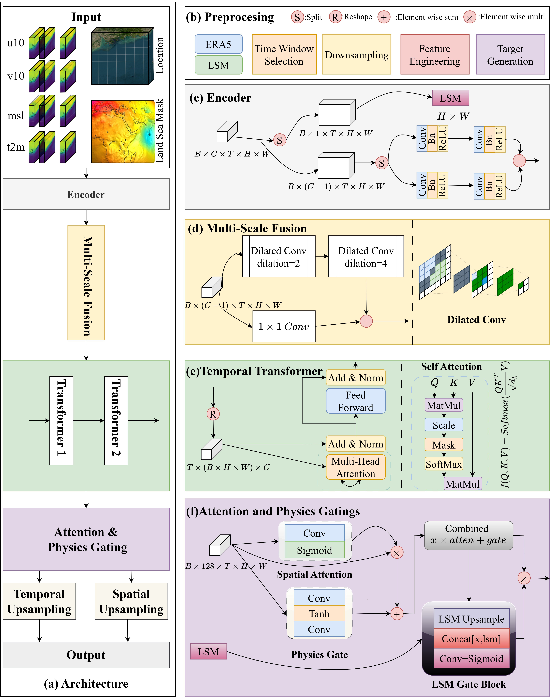
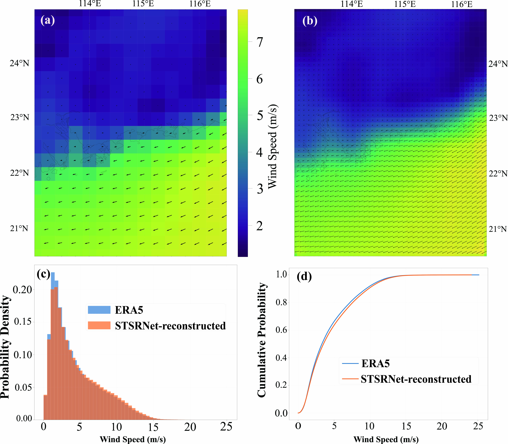

# STSRNet: A physics-guided deep learning framework for spatiotemporal super-resolution of coastal ERA5 wind fields

[](LICENSE)

A physics-guided spatiotemporal super-resolution network (STSRNet) for enhancing the resolution and physical consistency of ERA5 near-surface winds over coastal regions.

## Overview

STSRNet enhances both temporal and spatial resolution of ERA5 wind fields:
- **Temporal resolution**: from 1 hour to 10 minutes
- **Spatial resolution**: from 0.25° × 0.25° to approximately 0.1° × 0.1°

The model incorporates physics-guided constraints including:
- Divergence-based regularization for approximate mass conservation
- Land-sea mask gating mechanism for realistic coastal transitions

## Key Features

- **Physics-Informed Learning**: Embeds physical constraints (mass conservation, land-sea boundaries) directly into the loss function
- **Multi-Scale Architecture**: Combines 3D-CNN encoder, dilated convolutions, and temporal Transformer
- **Coastal Optimization**: Specifically designed for complex coastal wind fields with strong gradients
- **Validated Performance**: 6.4%–17.4% reduction in mean bias compared to ERA5 in the 4–25 m/s wind speed range

## Architecture

The STSRNet framework consists of three main components:

1. **Data-driven Backbone**: 3D-CNN encoder with multi-scale fusion and temporal Transformer
2. **Physics-Guided Mechanism**: Land-sea mask gating (phyGATE) and divergence regularization
3. **Spatiotemporal Upsampling**: Temporal and spatial resolution enhancement



## Installation

### Requirements

- Python 3.8+
- PyTorch 1.10+
- CUDA-capable GPU (recommended)

### Setup

```bash
# Clone the repository
git clone https://github.com/DLWangSan/ERA5WindRecon.git
cd ERA5WindRecon

# Install dependencies
pip install -r requirements.txt
```

## Quick start (inference)

The repository includes a small **example** ERA5 slice and matching land–sea mask under [`example_data/`](example_data/) so you can run inference without preparing full regional archives first.

1. **Install** dependencies as in [Installation](#installation) (PyTorch with CUDA is recommended; CPU works but is slower).

2. **Obtain a checkpoint and `normalizer.json`.** Training writes them next to the project root and under `runs/train/<model_type>/` (see [Training](#training)). For example, after training the `normal` variant you should have:
   - `runs/train/normal/stsr_best.pth`
   - `normalizer.json` (created in the working directory on the first training run if missing)

   You can train on the bundled example data (short run for smoke testing):

   ```bash
   python src/train.py \
       --era5_path example_data \
       --filename ERA5_2026_04_08.nc \
       --model_type normal \
       --lsm_path example_data/lsm_era5.nc \
       --epochs 1 \
       --batch_size 2
   ```

3. **Run inference** on the same example files and write a reconstructed NetCDF:

   ```bash
   python src/inference.py \
       --model_type normal \
       --checkpoint_path runs/train/normal/stsr_best.pth \
       --era5_path example_data/ERA5_2026_04_08.nc \
       --lsm_path example_data/lsm_era5.nc \
       --normalizer_path normalizer.json \
       --output_path outputs/example_reconstructed.nc
   ```

   Run these commands from the repository root. The script resolves imports relative to `src/`. The output directory is created if needed.

## Data Preparation

### Input Data

The model requires ERA5 NetCDF files with the following variables:
- `u10`: 10-meter zonal wind component
- `v10`: 10-meter meridional wind component
- `msl`: Mean sea level pressure
- `t2m`: 2-meter air temperature

### Land-Sea Mask

An optional land-sea mask (LSM) file can be provided to improve coastal transitions.

## Usage

### Training

```bash
python src/train.py \
    --era5_path /path/to/era5/data \
    --filename ERA5_2020-2024.nc \
    --model_type normal \
    --epochs 100 \
    --batch_size 8 \
    --lr 1e-4 \
    --lsm_path lsm_era5.nc
```

### Inference

```bash
python src/inference.py \
    --model_type normal \
    --checkpoint_path runs/train/normal/stsr_best.pth \
    --era5_path /path/to/era5/data/ERA5_2020-2024.nc \
    --output_path outputs/reconstructed.nc \
    --normalizer_path normalizer.json \
    --lsm_path lsm_era5.nc
```

## Model Variants

The repository includes several model variants for ablation studies:

- `normal`: Full STSRNet with all components
- `compare1`: Without multi-scale fusion
- `compare2`: Without temporal Transformer
- `compare3`: Without attention and physics gating
- `compare4`: Without LSM gating

## Results

### Performance Metrics

Validation against HadISD station observations shows:
- Mean bias reduction: 6.4%–17.4% in 4–25 m/s range
- Improved representation of coastal gradients
- Better capture of monsoon-related circulation patterns

### Visualizations




## Contact

For questions or issues, please contact:
- Email: wangshx59@mail2.sysu.edu.cn
- GitHub Issues: [Create an issue](https://github.com/DLWangSan/ERA5WindRecon/issues)


